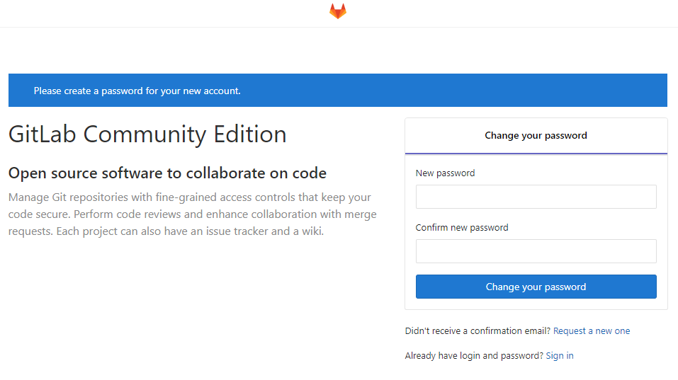
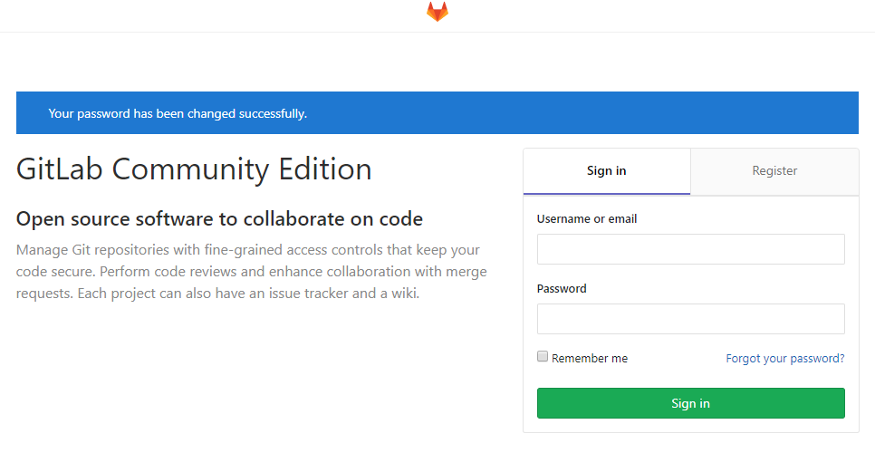

# 목차
- [Docker를 사용한 GitLab 설치](#user-content-docker를-사용한-gitlab-설치)
  - [Docker 설치](#user-content-docker-설치)
  - [Docker Compose 설치](#user-content-docker-compose-설치)
  - [GitLab 설치](#user-content-gitLab-설치)
  - [Redmine 접속](#user-content-redmine-접속)
  - [Redmine 접속 후 설정 할 내용](#user-content-redmine-접속-후-설정-할-내용)

# Docker를 사용한 Readmine 설치

## Docker 설치
```shell
# 기존 설치 내역 확인
~$ sudo yum list installed | grep docker

# 설치된 내역이 있으면 아래의 명령어로 삭제
~$ sudo yum remove docker docker-client docker-client-latest docker-common docker-latest docker-latest-logrotate docker-logrotate docker-selinux  docker-engine-selinux docker-engine

# 설치전 필요한 패키지 추가
~$ sudo yum install -y yum-utils device-mapper-persistent-data lvm2

# 최신버전을 위한 repo 추가
~$ sudo yum-config-manager --add-repo https://download.docker.com/linux/centos/docker-ce.repo

# 설치
~$ sudo yum install docker-ce

# Docker 시작
~$ sudo systemctl start docker

# Docker Service 등록
~$ sudo systemctl enable docker

# 실행 상태 확인
~$ sudo systemctl status docker

# 버전 확인
~$ sudo docker version
-- 출력내용 -----------------------------------------------------------------------------------
Client: <== 정보가 나오는지 확인
 Version:           18.09.1
 API version:       1.39
 Go version:        go1.10.6
 Git commit:        4c52b90
 Built:             Wed Jan  9 19:35:01 2019
 OS/Arch:           linux/amd64
 Experimental:      false

Server: Docker Engine - Community <== 정보가 나오는지 확인
 Engine:
  Version:          18.09.1
  API version:      1.39 (minimum version 1.12)
  Go version:       go1.10.6
  Git commit:       4c52b90
  Built:            Wed Jan  9 19:06:30 2019
  OS/Arch:          linux/amd64
  Experimental:     false
-- 출력내용 -----------------------------------------------------------------------------------

# 동작 테스트
~$ sudo docker run hello-world
-- 출력내용 -----------------------------------------------------------------------------------
Unable to find image 'hello-world:latest' locally
latest: Pulling from library/hello-world
1b930d010525: Pull complete
Digest: sha256:2557e3c07ed1e38f26e389462d03ed943586f744621577a99efb77324b0fe535
Status: Downloaded newer image for hello-world:latest

Hello from Docker!
This message shows that your installation appears to be working correctly.

To generate this message, Docker took the following steps:
 1. The Docker client contacted the Docker daemon.
 2. The Docker daemon pulled the "hello-world" image from the Docker Hub.
    (amd64)
 3. The Docker daemon created a new container from that image which runs the
    executable that produces the output you are currently reading.
 4. The Docker daemon streamed that output to the Docker client, which sent it
    to your terminal.

To try something more ambitious, you can run an Ubuntu container with:
 $ docker run -it ubuntu bash

Share images, automate workflows, and more with a free Docker ID:
 https://hub.docker.com/

For more examples and ideas, visit:
 https://docs.docker.com/get-started/
-- 출력내용 -----------------------------------------------------------------------------------
```

## Docker Compose 설치
```shell
# Docker Compose 받기
~$ sudo curl -L "https://github.com/docker/compose/releases/download/1.23.2/docker-compose-$(uname -s)-$(uname -m)" -o /usr/local/bin/docker-compose

# 실행 권한 추가
~$ sudo chmod +x /usr/local/bin/docker-compose

# 심볼릭 링크 생성
~$ sudo ln -s /usr/local/bin/docker-compose /usr/bin/docker-compose

# 버전 확인
~$ docker-compose --version
-- 출력내용 -----------------------------------------------------------------------------------
docker-compose version 1.23.2, build 1110ad01
-- 출력내용 -----------------------------------------------------------------------------------
```

## GitLab 설치
```shell
# GitLab 이미지 확인
~$ sudo docker search gitlab-ce
-- 출력내용 -----------------------------------------------------------------------------------
NAME                                         DESCRIPTION                                     STARS               OFFICIAL            AUTOMATED
centos                                       The official build of CentOS.                   5134                [OK]
gitlab/gitlab-ce                             GitLab Community Edition docker image based …   2363                                    [OK] <== 확인
sameersbn/gitlab                             Dockerized gitlab web server                    1097                                    [OK]
gitlab/gitlab-runner                         GitLab CI Multi Runner used to fetch and run…   467                                     [OK]
celery                                       Celery is an open source asynchronous task q…   227                 [OK]
twang2218/gitlab-ce-zh                       汉化的 GitLab 社区版 Docker Image                     163                                     [OK]
gitlab/gitlab-ee                             GitLab Enterprise Edition docker image based…   128
beginor/gitlab-ce                            GitLab Community Edition with zh-cn             37                                      [OK]
centurylink/gitlab                           This image uses the image from sameersbn / g…   26                                      [OK]
sgillespie/gitlab-runner                     A Dockerized GitLab Runner that automaticall…   3                                       [OK]
marq/gitlab-ce-subgit                        A GitLab container with SubGit included.        3                                       [OK]
yums/gitlab-ce-pages                         Unofficial GitLab pages for GitLab CE           3                                       [OK]
gitlab/gitlab-ce-qa                          GitLab QA has a test suite that allows end-t…   2
polinux/gitlab-ce                            GitLab-CE on Steroids (Extra features - see …   2                                       [OK]
primetoninc/gitlab                           gitlab-ce                                       1                                       [OK]
computersciencehouse/gitlab-ce-oidc          GitLab CE Docker image with OpenID Connect s…   1                                       [OK]
projectatomic/gitlab-centos7-atomicapp       Gitlab Atomic App                               1                                       [OK]
sbernard/gitlab-ce-kitchen                   Docker image based on gitlab/gitlab-ce provi…   1                                       [OK]
mastertinner/gitlab-merge-request-resource   A concourse resource to check for new merge …   1                                       [OK]
drud/gitlab-ce                                                                               0
rigoford/gitlab-ce                           Basic GitLab Community Edition                  0                                       [OK]
gitclub/gitlab-ce-zh                         gitlab-ce-zh                                    0                                       [OK]
adamkl/gitlab-merge-request-resource         Customized with support for gitlab ssh on di…   0                                       [OK]
slpcat/gitlab-ce                             gitlab-ce最新社区版10.1.0，omnibus二进制包                0
leadware/gitlab-ce                           Official Gitlab community edition extension     0
-- 출력내용 -----------------------------------------------------------------------------------

# Docker Compose 를 위한 디렉토리 생성
~$ mkdir -p local/docker/gitlab-ce

# 디렉토리 이동
~$ cd local/docker/gitlab-ce

# GitLab 외부 디렉토리 생성
gitlab-ce$ sudo mkdir config
gitlab-ce$ sudo mkdir logs
gitlab-ce$ sudo mkdir data

# docker-compose.yml 파일 생성
gitlab-ce$ vi docker-compose.yml
-- 작성내용 -----------------------------------------------------------------------------------
version: '3.7'
services:
  redmine:
    image: gitlab/gitlab-ce
    restart: always
    container_name: gitlab-ce
    hostname: 'gitlab.hunet.co.kr'
    ports:
      - 80:80
      - 433:443
      - 22:22
    environment:
      GITLAB_OMNIBUS_CONFIG: |
        external_url 'http://gitlab.hunet.co.kr'
        # Add any other gitlab.rb configuration here, each on its own line
    volumes:
      - '/srv/gitlab/config:/home/yourid/local/docker/gitlab-ce/config'
      - '/srv/gitlab/logs:/home/yourid/local/docker/gitlab-ce/logs'
      - '/srv/gitlab/data:/home/yourid/local/docker/gitlab-ce/data'
-- 작성내용 -----------------------------------------------------------------------------------

# Docker Compose 로 실행
gitlab-ce$ sudo docker-compose up -d
-- 출력내용 -----------------------------------------------------------------------------------
Creating network "gitlab-ce_default" with the default driver
Pulling redmine (gitlab/gitlab-ce:)...
latest: Pulling from gitlab/gitlab-ce
b849b56b69e7: Pull complete
42986ef25bcd: Pull complete
d927c1b717ec: Pull complete
15b86ea20233: Pull complete
6f48b03af638: Pull complete
5fe9e5ae5ece: Pull complete
f86298e1cd52: Pull complete
e627dd78398d: Pull complete
c3c063e36e69: Pull complete
a775899bd89d: Pull complete
Creating gitlab-ce ... done
-- 출력내용 -----------------------------------------------------------------------------------

# image 확인
gitlab-ce$ sudo docker images
-- 출력내용 -----------------------------------------------------------------------------------
REPOSITORY          TAG                 IMAGE ID            CREATED             SIZE
gitlab/gitlab-ce    latest              f77dd1b93b45        35 hours ago        1.59GB
-- 출력내용 -----------------------------------------------------------------------------------

# process 확인
gitlab-ce$ sudo docker ps -a
-- 출력내용 -----------------------------------------------------------------------------------
CONTAINER ID        IMAGE               COMMAND             CREATED             STATUS                      PORTS                                                                       NAMES
a90b71d7a8ee        gitlab/gitlab-ce    "/assets/wrapper"   2 minutes ago       Up 2 minutes (healthy)      22/tcp, 0.0.0.0:80->80/tcp, 0.0.0.0:433->443/tcp, 0.0.0.0:32768->1342/tcp   gitlab-ce
-- 출력내용 -----------------------------------------------------------------------------------

# port 열기
gitlab-ce$ sudo firewall-cmd --permanent --add-service=http
gitlab-ce$ sudo firewall-cmd --permanent --add-service=https
gitlab-ce$ sudo firewall-cmd --permanent --add-port=22/tcp
gitlab-ce$ sudo firewall-cmd --reload
gitlab-ce$ sudo firewall-cmd --list-all
gitlab-ce$ sudo systemctl restart firewalld

# Docker Compose 종료
gitlab-ce$ sudo docker-compose stop

# Docker Compose 재설정 : .yml 파일이 수정된 경우 재적용
gitlab-ce$ sudo docker-compose up -d

# Docker Compose 시작
gitlab-ce$ sudo docker-compose start

# Docker Container 삭제
gitlab-ce$ sudo docker rm [컨테이너명]

# Docker Container 전체 삭제
gitlab-ce$ sudo docker container prune

# Docker Image 삭제
gitlab-ce$ sudo docker rmi [이미지명]

# Docker Log 확인
gitlab-ce$ sudo docker logs -f -t gitlab-ce

# Docker 상태 확인
gitlab-ce$ sudo docker stats
-- 출력내용 -----------------------------------------------------------------------------------
CONTAINER ID        NAME                CPU %               MEM USAGE / LIMIT    MEM %               NET I/O             BLOCK I/O           PIDS
de2ad8473779        gitlab-ce           4.59%               2.63GiB / 3.701GiB   71.05%              38.1kB / 971kB      83.9MB / 3.77MB     285
-- 출력내용 -----------------------------------------------------------------------------------
## Ctrl + C 로 빠져나옴
```

## GitLab 접속
- 접속 URL : http://gitlab.sample.co.kr
- root 계정 비밀번호 설정 : changeme



- 비밀번호 설정 후 로그인



## GitLab 접속 후 설정 할 내용
1. 사용자 계정 등록
1. 그룹 등록
1. 그룹에 사용자 등록
1. 각 프로젝트 생성 및 정리
