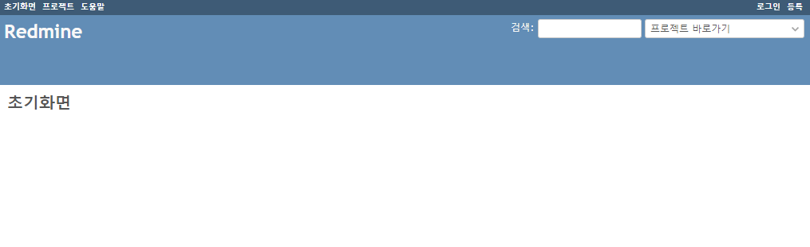

# 목차
- [Docker를 사용한 Readmine 설치](#user-content-docker를-사용한-readmine-설치)
  - [Docker 설치](#user-content-docker-설치)
  - [Docker Compose 설치](#user-content-docker-compose-설치)
  - [Redmine + MariaDB 설치](#user-content-redmine-mariadb-설치)
  - [Redmine 접속](#user-content-redmine-접속)
  - [Redmine 접속 후 설정 할 내용](#user-content-redmine-접속-후-설정-할-내용)

# Docker를 사용한 Readmine 설치

## Docker 설치
```shell
# 기존 설치 내역 확인
~$ sudo yum list installed | grep docker

# 설치된 내역이 있으면 아래의 명령어로 삭제
~$ sudo yum remove docker docker-client docker-client-latest docker-common docker-latest docker-latest-logrotate docker-logrotate docker-selinux  docker-engine-selinux docker-engine

# 설치전 필요한 패키지 추가
~$ sudo yum install -y yum-utils device-mapper-persistent-data lvm2

# 최신버전을 위한 repo 추가
~$ sudo yum-config-manager --add-repo https://download.docker.com/linux/centos/docker-ce.repo

# 설치
~$ sudo yum install docker-ce

# Docker 시작
~$ sudo systemctl start docker

# Docker Service 등록
~$ sudo systemctl enable docker

# 실행 상태 확인
~$ sudo systemctl status docker

# 버전 확인
~$ sudo docker version
-- 출력내용 -----------------------------------------------------------------------------------
Client: <== 정보가 나오는지 확인
 Version:           18.09.1
 API version:       1.39
 Go version:        go1.10.6
 Git commit:        4c52b90
 Built:             Wed Jan  9 19:35:01 2019
 OS/Arch:           linux/amd64
 Experimental:      false

Server: Docker Engine - Community <== 정보가 나오는지 확인
 Engine:
  Version:          18.09.1
  API version:      1.39 (minimum version 1.12)
  Go version:       go1.10.6
  Git commit:       4c52b90
  Built:            Wed Jan  9 19:06:30 2019
  OS/Arch:          linux/amd64
  Experimental:     false
-- 출력내용 -----------------------------------------------------------------------------------

# 동작 테스트
~$ sudo docker run hello-world
-- 출력내용 -----------------------------------------------------------------------------------
Unable to find image 'hello-world:latest' locally
latest: Pulling from library/hello-world
1b930d010525: Pull complete
Digest: sha256:2557e3c07ed1e38f26e389462d03ed943586f744621577a99efb77324b0fe535
Status: Downloaded newer image for hello-world:latest

Hello from Docker!
This message shows that your installation appears to be working correctly.

To generate this message, Docker took the following steps:
 1. The Docker client contacted the Docker daemon.
 2. The Docker daemon pulled the "hello-world" image from the Docker Hub.
    (amd64)
 3. The Docker daemon created a new container from that image which runs the
    executable that produces the output you are currently reading.
 4. The Docker daemon streamed that output to the Docker client, which sent it
    to your terminal.

To try something more ambitious, you can run an Ubuntu container with:
 $ docker run -it ubuntu bash

Share images, automate workflows, and more with a free Docker ID:
 https://hub.docker.com/

For more examples and ideas, visit:
 https://docs.docker.com/get-started/
-- 출력내용 -----------------------------------------------------------------------------------
```

## Docker Compose 설치
```shell
# Docker Compose 받기
~$ sudo curl -L "https://github.com/docker/compose/releases/download/1.23.2/docker-compose-$(uname -s)-$(uname -m)" -o /usr/local/bin/docker-compose

# 실행 권한 추가
~$ sudo chmod +x /usr/local/bin/docker-compose

# 심볼릭 링크 생성
~$ sudo ln -s /usr/local/bin/docker-compose /usr/bin/docker-compose

# 버전 확인
~$ docker-compose --version
-- 출력내용 -----------------------------------------------------------------------------------
docker-compose version 1.23.2, build 1110ad01
-- 출력내용 -----------------------------------------------------------------------------------
```

## Redmine + MariaDB 설치
```shell
# Redmine 이미지 확인
~$ sudo docker search redmine
-- 출력내용 -----------------------------------------------------------------------------------
NAME                              DESCRIPTION                                     STARS               OFFICIAL            AUTOMATED
redmine                           Redmine is a flexible project management web…   692                 [OK] <== 확인
sameersbn/redmine                                                                 297                                     [OK]
bitnami/redmine                   Bitnami Docker Image for Redmine                34                                      [OK]
74th/redmine-all-in-one           Redmine includes hosting SVN & Git , backlog…   9                                       [OK]
inspiredgeek/redmine-alpine       Simple Docker images to run Redmine tracker …   6                                       [OK]
eeacms/redmine                    EEA Redmine docker setup                        2                                       [OK]
arm32v7/redmine                   Redmine is a flexible project management web…   2
tkeydll/docker-redmine-backlogs   Redmine with backlogs plugin.                   1                                       [OK]
fjudith/redmine                   Dockerized Redmine based on redmine:3.3 offi…   1                                       [OK]
themill/redmine                   fork for redmine to add/test theming            1                                       [OK]
minimaru/openshift-redmine        A Debian8 based Redmine v3.2 image for use w…   1
arm64v8/redmine                   Redmine is a flexible project management web…   1
commonms/redmine                  Docker image for Redmine.                       1                                       [OK]
menlosystems/redmine              Redmine image for Docker with several extens…   0                                       [OK]
dockerpicosoft/redminemisfat                                                      0
rubykube/redmine                  Redmine 4.0 container                           0                                       [OK]
honsiorovskyi/redmine             Official Redmine + Git + Mercurial              0                                       [OK]
stackbrew/redmine                 Deprecated; use 'redmine' from https://hub.d…   0
trollin/redmine                                                                   0
thiagorider/redmine               Redmine Docker Image Automated Build Repo.      0                                       [OK]
amd64/redmine                     Redmine is a flexible project management web…   0
sccp/redmine                      redmine                                         0
mikroways/redmine                 redmine passenger image                         0                                       [OK]
i386/redmine                      Redmine is a flexible project management web…   0
s390x/redmine                     Redmine is a flexible project management web…   0
-- 출력내용 -----------------------------------------------------------------------------------

# Docker Compose 를 위한 디렉토리 생성
~$ mkdir -p local/docker/redmine

# 디렉토리 이동
~$ cd local/docker/redmine

# Redmine 외부 디렉토리 생성
redmine$ sudo mkdir files
redmine$ sudo mkdir plugins
redmine$ sudo mkdir -p vendor/plugins
redmine$ sudo mkdir -p public/themes
redmine$ sudo mkdir mysql

# docker-compose.yml 파일 생성
redmine$ vi docker-compose.yml
-- 작성내용 -----------------------------------------------------------------------------------
version: '3.7'

services:
  redmine:
    image: redmine
    restart: always
    container_name: redmine
    ports:
      - 3000:3000
    environment:
      REDMINE_DB_MYSQL: mysql
      REDMINE_DB_DATABASE: redmine
      REDMINE_DB_USERNAME: redmine
      REDMINE_DB_PASSWORD: redmine
      REDMINE_DB_ENCODING: utf8
    volumes:
      - /var/lib/redmine/files:/home/yourid/local/docker/redmine/files
      - /var/lib/redmine/plugins:/home/yourid/local/docker/redmine/plugins
      - /var/lib/redmine/vendor/plugins:/home/yourid/local/docker/redmine/vendor/plugins
      - /var/lib/redmine/public/themes:/home/yourid/local/docker/redmine/public/themes
    depends_on:
      - mysql
  mysql:
    image: mariadb
    restart: always
    ports:
      - 3306:3306
    environment:
      MYSQL_RANDOM_ROOT_PASSWORD: 'yes'
      MYSQL_ROOT_PASSWORD: mysql
      MYSQL_DATABASE: redmine
      MYSQL_USER: redmine
      MYSQL_PASSWORD: redmine
    command:
      - --character-set-server=utf8mb4
      - --collation-server=utf8mb4_unicode_ci
    volumes:
      - /var/lib/mysql:/home/yourid/local/docker/redmine/mysql
-- 작성내용 -----------------------------------------------------------------------------------

# Docker Compose 로 실행
redmine$ sudo docker-compose up -d
-- 출력내용 -----------------------------------------------------------------------------------
Creating network "redmine_default" with the default driver
Pulling mysql (mariadb:)...
latest: Pulling from library/mariadb
84ed7d2f608f: Pull complete
be2bf1c4a48d: Pull complete
a5bdc6303093: Pull complete
e9055237d68d: Pull complete
7eb9915af636: Pull complete
6368844241cc: Pull complete
4f7d49d7c8e4: Pull complete
cecb639f0dca: Pull complete
1cf91091f756: Pull complete
7824abcbc9b1: Pull complete
9b9ca59fd3c7: Pull complete
511ac364713c: Pull complete
a94c2797450a: Pull complete
24a11faefffa: Pull complete
Pulling redmine (redmine:)...
latest: Pulling from library/redmine
177e7ef0df69: Already exists
5bc198dc6212: Pull complete
f803bb5af245: Pull complete
a4e8acbc6a4f: Pull complete
f9baaf4fbbc1: Pull complete
a9d7ce23c7ca: Pull complete
15797a511488: Pull complete
a13cf35bbab0: Pull complete
b99a10f2c99e: Pull complete
b1108fa654c4: Pull complete
8e2f392cb07c: Pull complete
af448a184cba: Pull complete
30a1a98664fb: Pull complete
Creating redmine_mysql_1 ... done
Creating redmine         ... done
-- 출력내용 -----------------------------------------------------------------------------------

# image 확인
redmine$ sudo docker images
-- 출력내용 -----------------------------------------------------------------------------------
REPOSITORY          TAG                 IMAGE ID            CREATED             SIZE
redmine             latest              5dc52c20bd6a        3 days ago          579MB
mariadb             latest              2bdd97ca79d9        5 days ago          366MB
-- 출력내용 -----------------------------------------------------------------------------------

# process 확인
redmine$ sudo docker ps -a
-- 출력내용 -----------------------------------------------------------------------------------
CONTAINER ID        IMAGE               COMMAND                  CREATED             STATUS              PORTS                    NAMES
f3cb3deeb076        redmine             "/docker-entrypoint.…"   3 minutes ago       Up 3 minutes        0.0.0.0:3000->3000/tcp   redmine
fbe363fed85b        mariadb             "docker-entrypoint.s…"   3 minutes ago       Up 3 minutes        0.0.0.0:3306->3306/tcp   redmine_mysql_1
-- 출력내용 -----------------------------------------------------------------------------------

# port 열기
redmine$ sudo firewall-cmd --permanent --add-port=3000/tcp
redmine$ sudo firewall-cmd --reload
redmine$ sudo firewall-cmd --list-all
redmine$ sudo systemctl restart firewalld

# MySQL 확인
redmine$ docker exec -i -t mysql bash
root@e208ef4a24c7:/# mysql -u redmine -p

# Docker Compose 종료
redmine$ sudo docker-compose stop

# Docker Compose 재설정 : .yml 파일이 수정된 경우 재적용
redmine$ sudo docker-compose up -d

# Docker Compose 시작
redmine$ sudo docker-compose start

# Docker Container 삭제
redmine$ sudo docker rm [컨테이너명]

# Docker Container 전체 삭제
redmine$ sudo docker container prune

# Docker Image 삭제
redmine$ sudo docker rmi [이미지명]

# Docker Log 확인
redmine$ sudo docker logs -f -t redmine

# Docker 상태 확인
redmine$ sudo docker stats
-- 출력내용 -----------------------------------------------------------------------------------
CONTAINER ID        NAME                CPU %               MEM USAGE / LIMIT     MEM %               NET I/O             BLOCK I/O           PIDS
f3cb3deeb076        redmine             0.00%               109.1MiB / 3.701GiB   2.88%               321kB / 78.4kB      142MB / 81.9kB      3
fbe363fed85b        redmine_mysql_1     0.05%               93.81MiB / 3.701GiB   2.48%               79.4kB / 320kB      100MB / 4.38MB      31
CONTAINER ID        NAME                CPU %               MEM USAGE / LIMIT     MEM %               NET I/O             BLOCK I/O           PIDS
f3cb3deeb076        redmine             0.00%               109.1MiB / 3.701GiB   2.88%               321kB / 78.4kB      142MB / 81.9kB      3
fbe363fed85b        redmine_mysql_1     0.05%               93.81MiB / 3.701GiB   2.48%               79.4kB / 320kB      100MB / 4.38MB      31
-- 출력내용 -----------------------------------------------------------------------------------
## Ctrl + C 로 빠져나옴
```

## Redmine 접속
- 접속 URL : http://192.168.56.110:300
- 최초 접속 계정 : admin / admin
<br />



## Redmine 접속 후 설정 할 내용
1. 관리자 계정 비밀번호 변경
1. 상단 메뉴 이동 : 관리
1. 그룹 생성
1. 역할 및 권한 생성
1. 일감 유형 생성
1. 일감 상태 생성
1. 코드값 에서 일감 우선순위 생성
1. 사용자 생성
1. 프로젝트 생성
